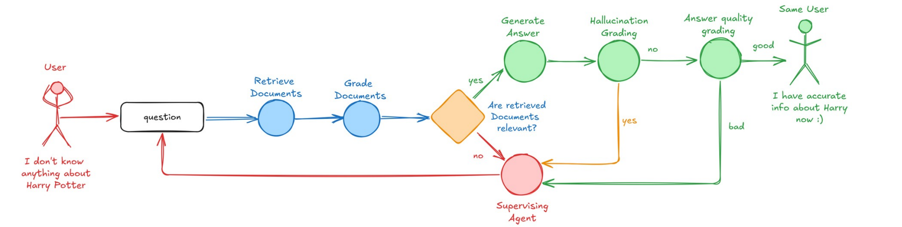

Simple Agentic RAG application with Few Shot learning technique.

For this project we will be locally setting up a LLM RAG Pipeline which will have -
1. Supervising Agent - This agent will keep a check on all the agents and instantiate them as
and when required.
2. Document Retrieval grading Agent - This agent will assess based on the user question if
the documents retrieved are accurate or not.
3. Hallucination grading Agent - This agent will assess the LLM response to check if the
generated answer is factually correct or not based on the documents used.
4. Answer grading Agent - This agent will assess the LLM response based on the question
asked if the answer meets the required criteria.
5. LangGraph Visualization - Capturing visual information of how all agents work in tandem.

All this controlled to have maximum retries of 3 through LangGraph Streamer
